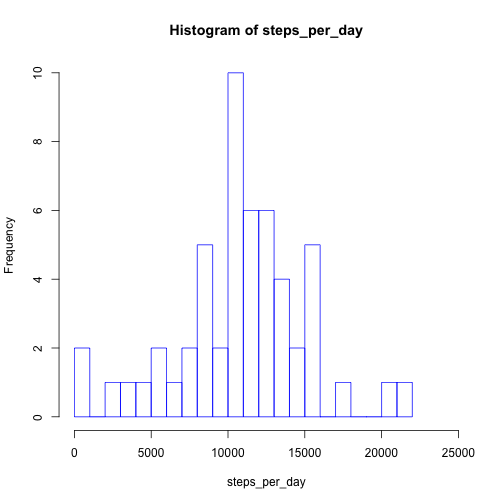
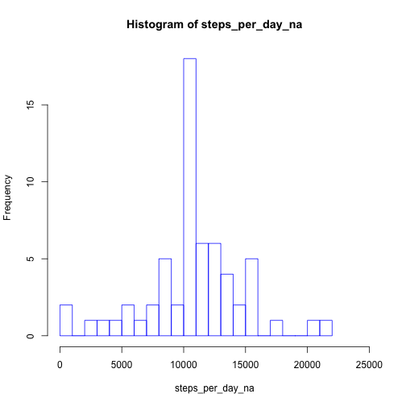

# Reproducible Research: Peer Assessment 1
This assignment makes use of data from a personal activity monitoring device. This device collects data at 5 minute intervals through out the day. The data consists of two months of data from an anonymous individual collected during the months of October and November, 2012 and include the number of steps taken in 5 minute intervals each day.

## Loading and preprocessing the data

```r
unzip("activity.zip")
activity <- read.csv("activity.csv")
```
Check data.

```r
summary(activity)
```

```
##      steps               date          interval   
##  Min.   :  0.0   2012-10-01:  288   Min.   :   0  
##  1st Qu.:  0.0   2012-10-02:  288   1st Qu.: 589  
##  Median :  0.0   2012-10-03:  288   Median :1178  
##  Mean   : 37.4   2012-10-04:  288   Mean   :1178  
##  3rd Qu.: 12.0   2012-10-05:  288   3rd Qu.:1766  
##  Max.   :806.0   2012-10-06:  288   Max.   :2355  
##  NA's   :2304    (Other)   :15840
```

## What is mean total number of steps taken per day?  
- Make a histogram of the total number of steps taken each day

```r
steps_per_day <- aggregate(steps ~ date, activity,sum)$steps
hist(steps_per_day, breaks=20, xlim=c(0,25000), border="blue")
```

 

- Calculate and report the **mean** and **median** total number of steps taken per day   

MEAN:         

```r
mean(steps_per_day)
```

```
## [1] 10766
```
               
MEDIAN:

```r
median(steps_per_day)
```

```
## [1] 10765
```


## What is the average daily activity pattern?
- Make a time series plot (i.e. `type = "l"`) of the 5-minute interval (x-axis) and the average number of steps taken, averaged across all days (y-axis)

```r
steps_by_interval <- aggregate(steps ~ interval,activity, mean)
plot(steps_by_interval$steps, type="l")
```

 

- Which 5-minute interval, on average across all the days in the dataset, contains the maximum number of steps?

```r
max_interval = which.max(steps_by_interval$steps)
steps_by_interval$interval[max_interval]
```

```
## [1] 835
```

## Imputing missing values
- Calculate and report the total number of missing values in the dataset (i.e. the total number of rows with `NA`s)

```r
sum(is.na(activity))
```

```
## [1] 2304
```

- Devise a strategy for filling in all of the missing values in the dataset. The strategy does not need to be sophisticated. For example, you could use the mean/median for that day, or the mean for that 5-minute interval, etc.

*Use the mean for the 5-minute interval for filling missing values*

- Create a new dataset that is equal to the original dataset but with the missing data filled in.

```r
activity <- merge(activity, steps_by_interval, by="interval", suffixes=c("",".y"))
na_s <- is.na(activity$steps)
activity$steps[na_s] <- activity$steps.y[na_s]
activity <- activity[,c(1:3)]
```

- Make a histogram of the total number of steps taken each day and Calculate and report the **mean** and **median** total number of steps taken per day. Do these values differ from the estimates from the first part of the assignment? What is the impact of imputing missing data on the estimates of the total daily number of steps?


```r
steps_per_day_na <- aggregate(steps ~ date, activity, sum)$steps
hist(steps_per_day_na, breaks=20, xlim=c(0,25000), border="blue")
```

 

```r
mean(steps_per_day_na)
```

```
## [1] 10766
```

```r
median(steps_per_day_na)
```

```
## [1] 10766
```

The impact of the missing data seems not significant, considering the difference between the new mean and median with original ones.


## Are there differences in activity patterns between weekdays and weekends?

- Create a new factor variable in the dataset with two levels -- "weekday" and "weekend" indicating whether a given date is a weekday or weekend day.


```r
daytype <- function(date) {
    if (weekdays(as.Date(date)) %in% c("Saturday", "Sunday")) {
        "weekend"
    } else {
        "weekday"
    }
}
activity$daytype <- as.factor(sapply(activity$date, daytype))
```

- Make a panel plot containing a time series plot (i.e. `type = "l"`)of the 5-minute interval (x-axis) and the average number of steps taken, averaged across all weekday days or weekend days (y-axis).


```r
par(mfrow=c(2,1))
for (type in c("weekend", "weekday")) {
    steps_by_type <- aggregate(steps ~ interval, data=activity, subset=activity$daytype==type,FUN=mean)
    plot(steps_by_type, type="l", main=type)
}
```

 


